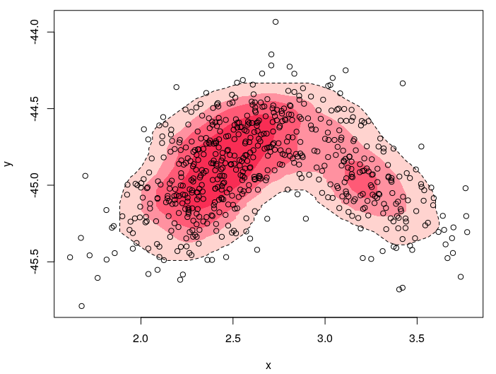

kernelgon
============

The function `kernelgon` will calculate and plot polygons in base R graphics based on a collection of points stored as an $n$ by 2 matrix.

Requirements:
- R (v 3.3.2 or greater) https://cran.r-project.org/
- `ks` package (v 1.11.2 or greater)
- `concaveman` package (v 1.0.0 or greater)
- `igraph` package (v 1.2.1 or greater)


## Installation notes

Some of the above libraries may require you first install other programs outside of R. On Ubuntu 17.04, you may need to install `libudunits2.so` first via 

```
sudo apt-get install libudunits2-dev
```

in the terminal. A `concaveman` dependency, the `V8` package, may also need a the `libv8` library file using

```
sudo apt-get install -y libv8-3.14-dev
```

# Usage

The package and function `kernelgon` simply combines the kernel density estimation of the `ks` package with the polygon-tracing abilities of `concaveman`. We can set plot the intervals on any $n$ by 2 matrix of coordinates via

```{r}

d <- data.frame(x = rnorm(100, 0, 1), y = rnorm(100, 100, 5))

plot(d)
kernelgon(d)

```

For important theoretical reasons, the default highest-density interval is 89%, implying about that many observations should fall within this area. This can be changed to any probability interval by the `prob` argument.

```
plot(d)
kernelgon(d, prob = 0.5)
kernelgon(d, prob = 0.95)

```

Because `kernelgon` works exactly like `polygon`, it accepts any of the normal arguments and is extremely flexible.

```
plot(d)
kernelgon(d, prob = 0.5, lty = 2, border = "blue")
kernelgon(d, prob = 0.95, lty = 3, border = "red")

```

The `res` argument controls the line resolution; too small and the lines look jagged, but too large and the polygon loses detail.

One nice thing about this is that it is not fooled by bimodal distributions, 

```{r}

correlator <- function(r, x.mean=0, x.sd=1, y.mean=0, y.sd=1, n=1000){
    x <- rnorm(n, mean=x.mean, sd=x.sd)
    y <- rnorm(n, mean=r*(y.sd/x.sd)*(x-x.mean)+y.mean, sd=sqrt((1-r^2))*y.sd)
    data.frame(x,y)
}

col_alpha <- function (acol, alpha = 0.2){
    acol <- col2rgb(acol)
    acol.red <- acol["red",]/255
    acol.green <- acol["green",]/255
    acol.blue <- acol["blue",]/255
    acol <- mapply(function(red, green, blue, alphas) rgb(red, green, blue, alphas), acol.red, acol.green, acol.blue, alpha)
    return(as.character(acol))
}

rose <- c(
  "#FFA8A0", 
  #"#FF7489", 
  "#FF5072", 
  "#FF254D", 
  "#F10033",
  "white"
)

n_obs <- 400

base <- correlator(0.6, x.mean = 2.4, x.sd = 0.25, y.mean = -44.9, y.sd = 0.3, n = 400)
add <- correlator(-0.6, x.mean = 3.2, x.sd = 0.25, y.mean = -44.9, y.sd = 0.3, n = 200)
d <- rbind(base, add)

plot(d, col = NULL)
kernelgon(d, prob = 0.89, col = col_alpha(rose[1], 0.5), lty = 2)
kernelgon(d, prob = 0.7, col = col_alpha(rose[2], 0.5), border = NA)
kernelgon(d, prob = 0.5, col = col_alpha(rose[3], 0.5), border = NA)
kernelgon(d, prob = 0.25, col = col_alpha(rose[4], 0.5), border = NA)
points(d)

```

